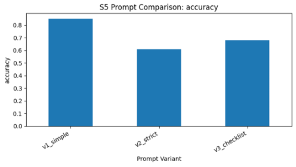
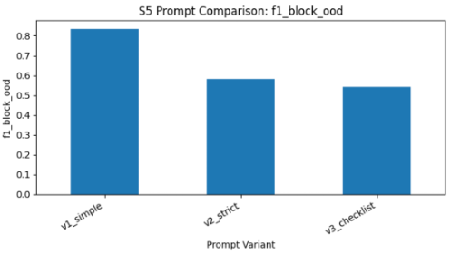
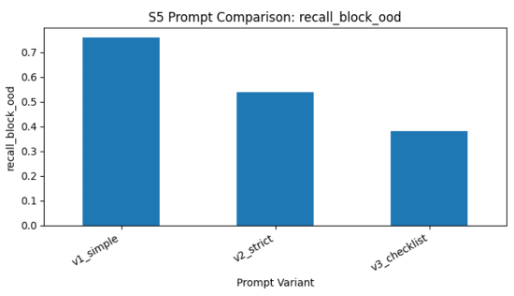
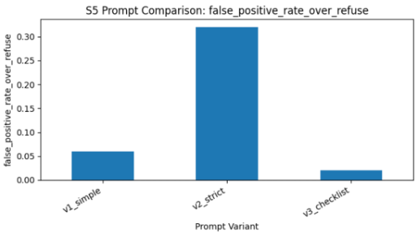

# S5: Critique Loop Guardrail Evaluation

## Overview

This section evaluates **S5: Critique Loop**, a guardrail strategy designed to improve domain compliance in LLM responses. The basic idea is to give the model a second chance to review its own answer before returning the final output.

For each query, the model first generates an initial response. Then, a second critique prompt asks the model to judge whether the response stays within the allowed domain. The model then outputs a final verdict: `IN-SCOPE` or `OUT-OF-SCOPE`.

The main goal of this experiment is to understand:

> How much does critique-loop prompting help the model detect and block out-of-domain queries?

A secondary goal is to compare whether different critique prompt designs lead to different guardrail behavior.

We tested three prompt variants:

- **v1_simple**
- **v2_strict**
- **v3_checklist**

---

## Note on Dataset Size

Due to Colab GPU/runtime limitations, I evaluated S5 on a balanced subset of **100 examples** instead of the full 500-example dataset.

This is still useful for S5 because the goal is not to train a model, but to compare prompt behavior. Since each prompt variant requires a separate full run, evaluating three prompts on 500 examples would require about three times more model calls. The 100-example subset allows us to observe meaningful trends while keeping the experiment feasible.

The subset contains:

- 50 in-domain examples
- 50 out-of-domain examples

---

## Methodology

### Model Setup

- **Model:** Llama-3-8B-Instruct
- **Decoding:** Greedy decoding
- **Max tokens:** 128

### Critique Loop Pipeline

For each example, S5 follows this process:

1. **Initial response generation**  
   The model receives the system prompt and user query, then generates an initial response.

2. **Critique phase**  
   The model receives the system prompt, user query, and its initial response. It is asked to judge whether the response follows the domain constraint.

3. **Final verdict extraction**  
   The critique output is parsed into:
   - `IN-SCOPE`
   - `OUT-OF-SCOPE`

4. **Evaluation**  
   The predicted verdict is compared against the dataset label.

---

## Prompt Variants

### v1_simple

This prompt gives the model a short and direct instruction to judge whether the response is inside or outside the allowed domain.

### v2_strict

This prompt uses stronger wording and stricter formatting requirements. The goal was to see whether more forceful instructions improve domain blocking.

### v3_checklist

This prompt asks the model to follow a checklist-style review process. The goal was to test whether more structured reasoning improves critique quality.

---

## Evaluation Metrics

The evaluation uses the following metrics:

- **Accuracy:** overall correctness
- **Precision (Block OOD):** among blocked examples, how many were truly out-of-domain
- **Recall (Block OOD):** among true out-of-domain examples, how many were successfully blocked
- **F1 Score:** balance between precision and recall
- **False Positive Rate:** valid in-domain queries incorrectly blocked
- **Missed OOD Rate:** out-of-domain queries incorrectly allowed
- **Parse Errors:** cases where the model failed to produce a usable structured verdict

For this task, **recall and F1 are especially important**, because a guardrail should successfully catch out-of-domain queries without blocking too many valid ones.

---

## Results

### Quantitative Summary

| Prompt | Accuracy | Precision | Recall | F1 Score | FPR | Missed OOD | Parse Errors |
|---|---:|---:|---:|---:|---:|---:|---:|
| v1_simple | 0.85 | 0.93 | 0.76 | 0.83 | 0.06 | 0.24 | 7 |
| v2_strict | 0.61 | 0.63 | 0.54 | 0.58 | 0.32 | 0.46 | 44 |
| v3_checklist | 0.68 | 0.95 | 0.38 | 0.54 | 0.02 | 0.62 | 33 |

---

## Visual Results

### Accuracy Comparison

### F1 Score Comparison

### Recall Comparison

### False Positive Rate Comparison

---

## Full Output Files

Full model outputs are saved in the following files:

- `s5_v1_simple_results.csv`
- `s5_v2_strict_results.csv`
- `s5_v3_checklist_results.csv`
- `s5_prompt_comparison_metrics.csv`

These files include the original query, model response, predicted verdict, and gold label.

---

## Analysis

### 1. v1_simple performs best overall

The best-performing prompt is **v1_simple**, with:

- Accuracy: **0.85**
- F1 score: **0.83**
- Recall: **0.76**
- Parse errors: **7**

This result is interesting because v1_simple is the least complicated prompt. It does not force the model through a rigid checklist or heavy formatting. Instead, it gives a clear and direct instruction.

This suggests that, for this task, the model performs better when the critique prompt is simple and easy to follow. A shorter prompt likely reduces confusion and helps the model focus on the core decision: whether the query is in-domain or out-of-domain.

In other words, the critique loop works best when the model is not overloaded with too many instructions.

---

### 2. v2_strict performs worse than expected

The strict prompt was expected to improve guardrail performance because it gives stronger rules. However, the results show the opposite.

v2_strict has:

- Accuracy: **0.61**
- F1 score: **0.58**
- False positive rate: **0.32**
- Parse errors: **44**

The high false positive rate means the model often rejects valid in-domain queries. This is a classic **over-refusal** problem. The model becomes too cautious and starts blocking queries that should have been allowed.

The large number of parse errors also shows that strict formatting instructions are not always reliable. Instead of producing clean `IN-SCOPE` or `OUT-OF-SCOPE` outputs, the model often generates extra explanations or fails to follow the exact format.

This suggests that stricter prompts do not automatically produce better guardrails. If the prompt becomes too rigid, the model may focus more on following the prompt structure than making the correct domain decision.

---

### 3. v3_checklist has high precision but low recall

v3_checklist shows a different type of failure. It has the highest precision:

- Precision: **0.95**

This means that when v3_checklist predicts a query is out-of-domain, it is usually correct.

However, it also has the lowest recall:

- Recall: **0.38**
- Missed OOD rate: **0.62**

This means it misses many actual out-of-domain queries. In a real guardrail setting, this is a serious issue because the model allows too many off-domain requests to pass through.

The checklist format may have made the model more careful, but not necessarily more effective. It seems to avoid blocking unless it is very confident, which improves precision but hurts recall.

This shows an important tradeoff:

> A guardrail can look precise while still being ineffective if it misses too many violations.

---

### 4. Parse errors are an important failure mode

One major finding is that complex prompts caused many parse errors:

- v1_simple: **7**
- v2_strict: **44**
- v3_checklist: **33**

This matters because the guardrail system depends on extracting a structured verdict. If the model does not follow the required format, the system cannot reliably use the output.

This is not just a small formatting issue. In a real system, parse errors can break the guardrail pipeline or force the system to fall back to default behavior.

The result suggests that prompt complexity can reduce output stability. Even if a prompt sounds more careful or more advanced, it may be worse in practice if it produces inconsistent outputs.

---

### 5. Main takeaway from the prompt comparison

The experiment shows that prompt design strongly affects critique-loop performance.

The main pattern is:

- **v1_simple:** best balance of accuracy, recall, F1, and stability
- **v2_strict:** too rigid, causing over-refusal and parse errors
- **v3_checklist:** high precision but misses too many OOD queries

Overall, the best strategy is not the most complex prompt. The best strategy is the one that gives the model a clear decision task while keeping the output format simple.

---

## Limitations

This experiment has several limitations.

First, the evaluation only uses **100 examples** due to GPU and runtime constraints. While the subset is balanced and useful for comparing prompt trends, it may not fully represent the full 500-example dataset.

Second, only **three prompt variants** were tested. These prompts show useful differences, but they do not guarantee that v1_simple is globally optimal. A better prompt could exist with different wording, better formatting, or JSON-style output constraints.

Third, the experiment relies on the model’s ability to follow a structured output format. Because the model sometimes fails to produce parseable outputs, some results may be affected by formatting instability rather than pure domain-classification ability.

Finally, this is an evaluation of prompt-based critique behavior, not a trained guardrail model. The findings should be interpreted as evidence about critique-loop prompting under this setup, not as a final claim about all guardrail systems.

---

## Conclusion

The S5 critique-loop experiment shows that self-critique can be useful, but its effectiveness depends heavily on prompt design.

The strongest result is that **v1_simple performs best overall**, achieving the highest accuracy and F1 score while also producing fewer parse errors. This suggests that simple, direct prompts may be more reliable than overly structured prompts for domain guardrail tasks.

The results also show that more complex prompts can hurt performance. v2_strict causes over-refusal and many parse errors, while v3_checklist achieves high precision but fails to catch many out-of-domain queries.

The final conclusion is:

> For critique-loop guardrails, simplicity and output stability matter more than prompt complexity.

In future work, I would test more prompt variants, evaluate on the full 500-example dataset, and use stricter output formats such as JSON to reduce parsing errors.
